# Django_Friends

### Django-сервис друзей, предоставляющий возможности:
- Регистрировать нового пользователя;
- Отправлять заявки в друзья;
- Принять/отклонить заявку в друзья;
- Посмотреть пользователю список исходящих/входящих заявок;
- Посмотреть пользователю список друзей;
- Получить пользователю статус дружбы с пользователем;
- Удалить пользователя из друзей;
- Автоматически принимать заявки при взаимном добавлении в друзья.

## Содержание

1. [Используемые технологии](#используемые-технологии)
2. [Краткая документация API](#краткая-документация-api) \
    2.1. [Запуск сервера](#0-запуск-сервера) \
    2.2. [Регистрация](#1-регистрация) \
    2.3. [Просмотр всех доступных пользователей](#2-просмотр-всех-доступных-пользователей) \
    2.4. [Запрос в друзья](#3-запрос-в-друзья) \
    2.5. [Добавление в друзья](#4-добавление-в-друзья) \
    2.6. [Удаление из друзей](#5-удаление-из-друзей) \
    2.7. [Взаимные запросы в друзья](#6-взаимные-запросы-в-друзья)
3. [Docker](#docker)

## Используемые технологии
- Python 3.10
- Django 4.2.1
- Django Rest Framework 3.14
- PostgreSQL 15
- Docker
- Swagger

## Краткая документация API

Для сервиса настроен Swagger, где можно найти описание ресурсов, конечные точки и методы, параметры, примеры схем и ответов.
Для демонстрации работы API мы будем использовать его. Вы также можете ознакомиться с ним самостоятельно на сайте 
**[vshivtsev.site](http://vshivtsev.site/swagger/)**. Файл со спецификацией находится в репозитории.

### 0. Запуск сервера

Для старта работы с API запустим сервер с помощью команды `./manage.py runserver`.

### 1. Регистрация
Зарегестрируем нового пользователя с `username = andrey` (Далее Андрей). Для регистрации и авторизации был использован пакет djoser. 
Перейдём в Swagger и отправим `POST` запрос с данными нового пользователя по пути `/auth/users/`:

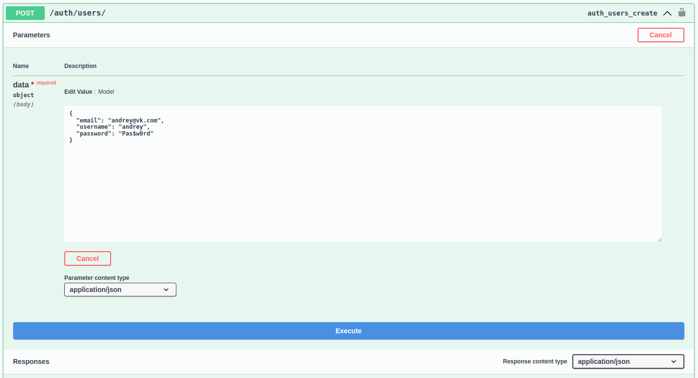

Проверим, что регистрация прошла успешно по адресу `/auth/users/{id}/` (`GET`):

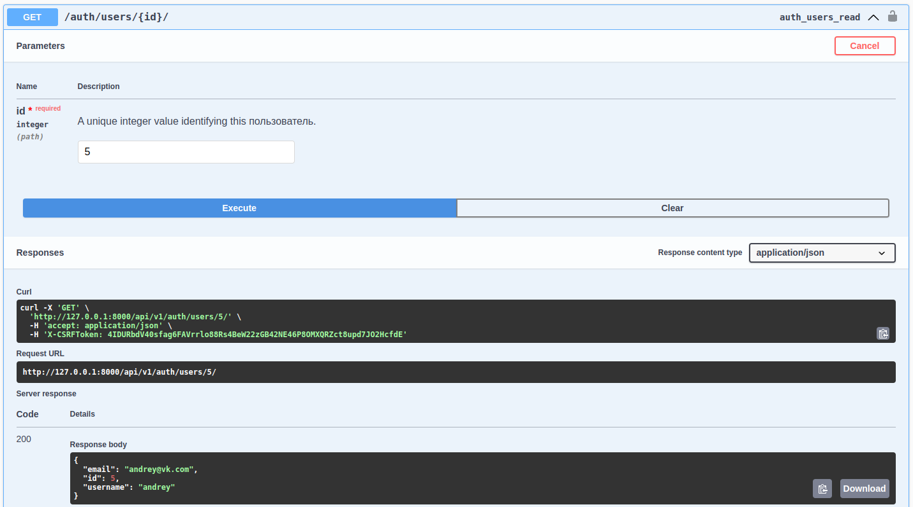

Войдем под нашим новым пользоватлем используя форму rest framework по адресу `/api-auth/login/`

### 2. Просмотр всех доступных пользователей

Посмотрим, кто уже есть в нашем сервисе, чтобы найти там будущего друга. Отправим `GET` запрос по адресу `/friends/all-users/`:

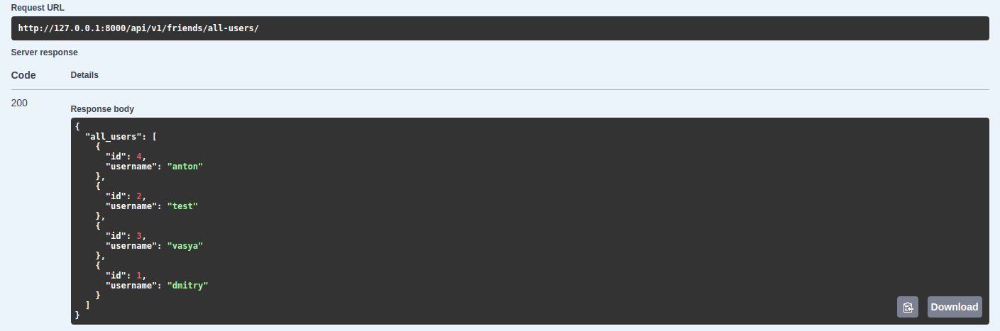

### 3. Запрос в друзья

Отлично. Попробуем отправить заявку пользователю **vasya** (Далее Вася). Отправим `POST` запрос по адресу `/friends/befriend/{id}`, где `id` 
это идентификатор пользователя, которому мы отправляем заявку. У Васи id = 3. Но сначала посмотрим, какой у нас с ним статус дружбы 
с помощью `GET` запроса по адресу `/friends/status/{id}/`:

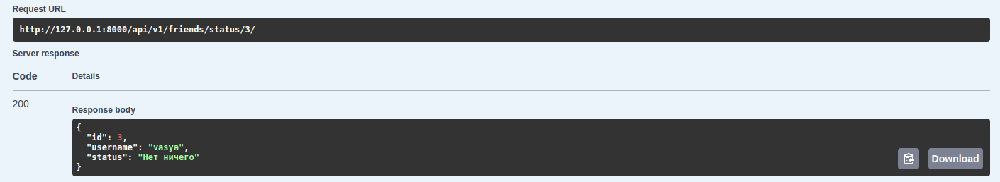

Мы с ним еще не дружим. Отправим заявку:

Посмотрим какой статус теперь:

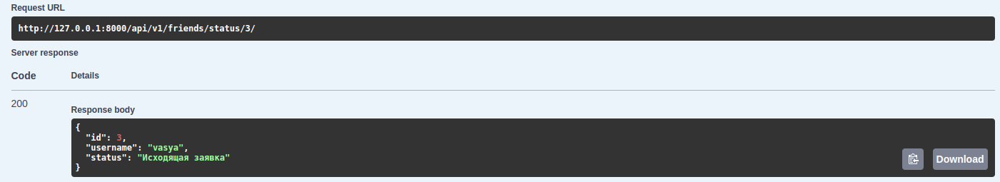

Заявка отправлена! Проверим так же исходящие заявки Андрея с помощью `GET` запроса по пути `/friends/outcoming/`:

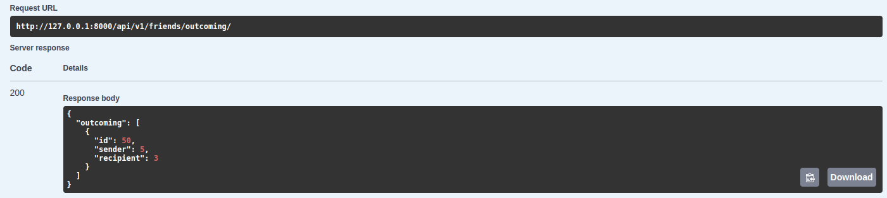 

Теперь посмотрим, что может сделать Вася.

### 4. Добавление в друзья

Зайдем под профилем Васи. Вася может принять, отклонить или отправить взаимную заявку (Что так же подружит ребят). Сначала посмотрим, что увидит Вася в профиле. \
Получим `GET` запрос по адресу `/friends/incoming/`:

У Васи появилась входящая заявка от Андрея. Посмотрим также статус дружбы с Андреем с профиля Васи:

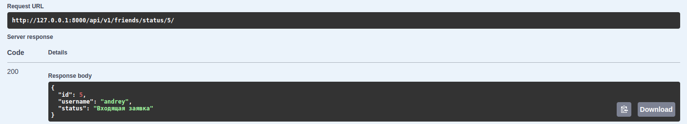

Статус дружбы "Входящая заявка", всё в порядке.

Вася знает Андрея, поэтому он хочет принять заявку в друзья. Для этого отправим `POST` запрос по адресу `/friends/accept/{id}`, где `id` 
это идентификатор Андрея (5):

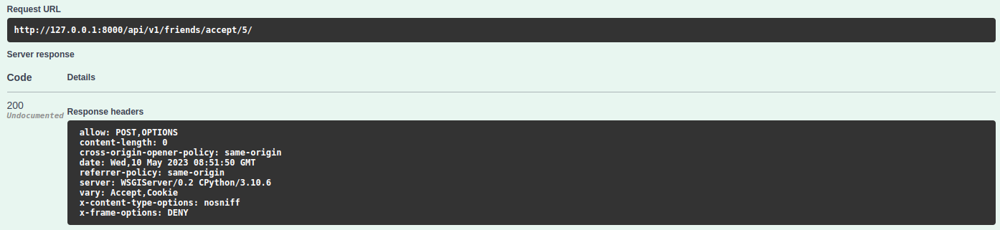 

Теперь проверим статус дружбы и список друзей Васи.

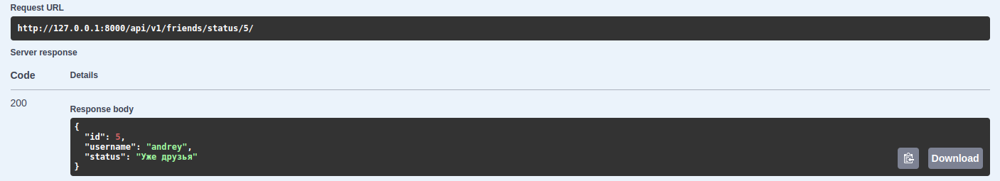
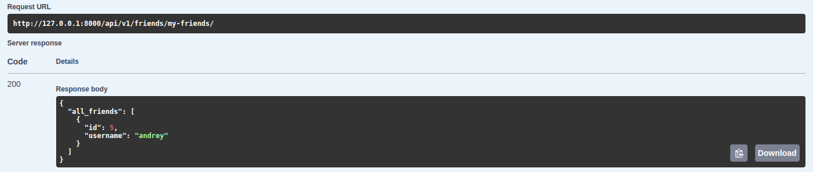

### 5. Удаление из друзей

Вася и Андрей стали друзьями. Но вдруг Вася поссорился с Андреем и решил удалить его из друзей. \
Для этого нужно отправить `POST` запрос по адресу `/friends/unfriend/{id}`, где `id` это идентификатор пользователя, 
которого нужно удалить из друзей. В нашем случае `id = 5`. \

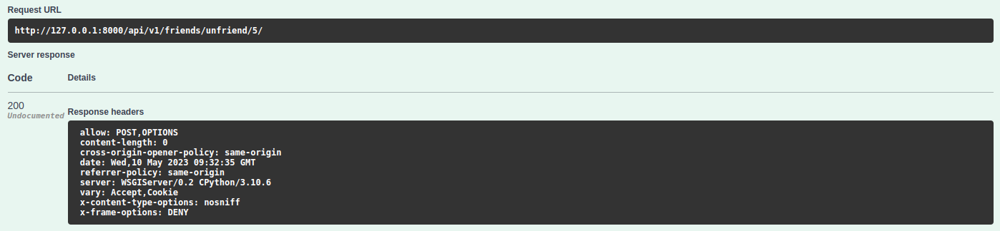

Смотрим список друзей:

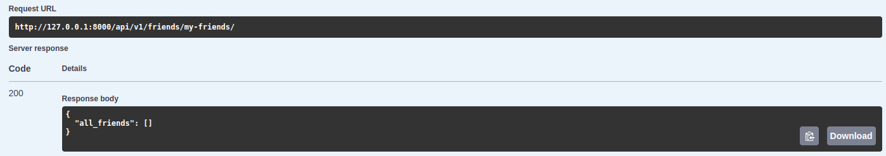

Андрей пропал из списка друзей.

### 6. Взаимные запросы в друзья

Через пару дней Вася с Андреем снова помирились и решили снова добавить друг-друга в друзья.
Вася отправляет запрос Андрею с помощью `POST` запроса по адресу `/friends/befriend/5`:

Смотрим исходящие заявки (`/friends/outcoming/`):

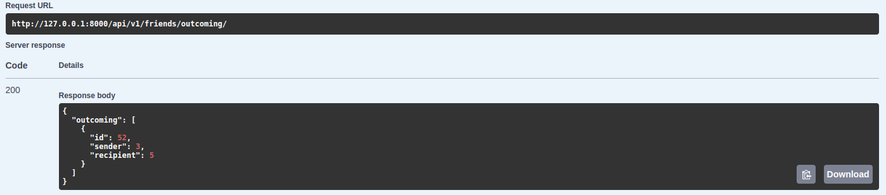

**Заходим в профиль Андрея**, и тоже отправляем запрос в друзья:

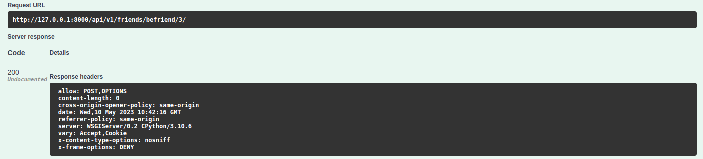

Вася автоматически появляется в друзьях Андрея.

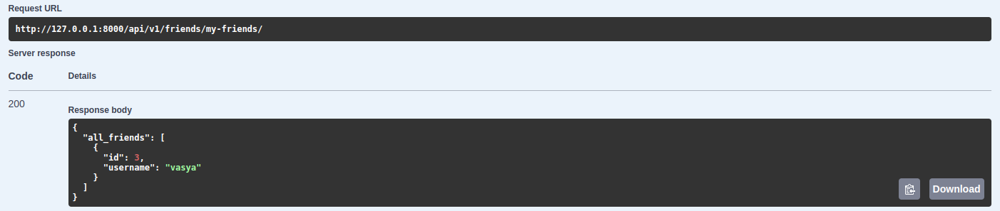

## Docker

Для упаковки в контейнер с установкой всех необходимых зависимостей создан Dockerfile. Для удобства разворачивания и удаления 
контейнера имеется Makefile с необходимыми командами.

> Далее контейнер будет разворачиваться на удаленном сервере с маппингом портов. Посмотреть API сервиса можно на 
> сайте **[vshivtsev.site](http://vshivtsev.site/swagger/)**. При необходимости измените команды под свои задачи.

> Файл `install.sh` содержит вирутальные переменные, установку зависимостей и запуск сервера. Он находится на сервере и не 
> добавляется в публичный репозиторий.
> 
#### Для запуска контейнера на сервере выполним команду `make docker` в корневой директории:
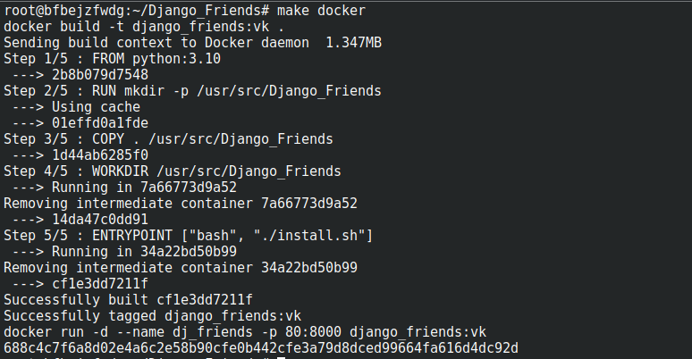

#### С помощью команды `docker ps` проверим, что контейнер успешно запущен:

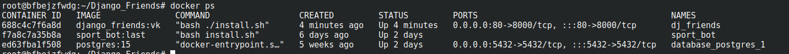

#### Перейдем на сайт **[vshivtsev.site](http://vshivtsev.site/swagger/)** и проверяем, что всё работает корректно:

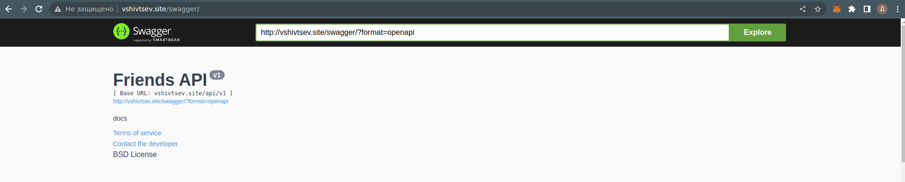

#### Для остановки и удаления запущенного контейнера используйте команду `make clean_docker`

